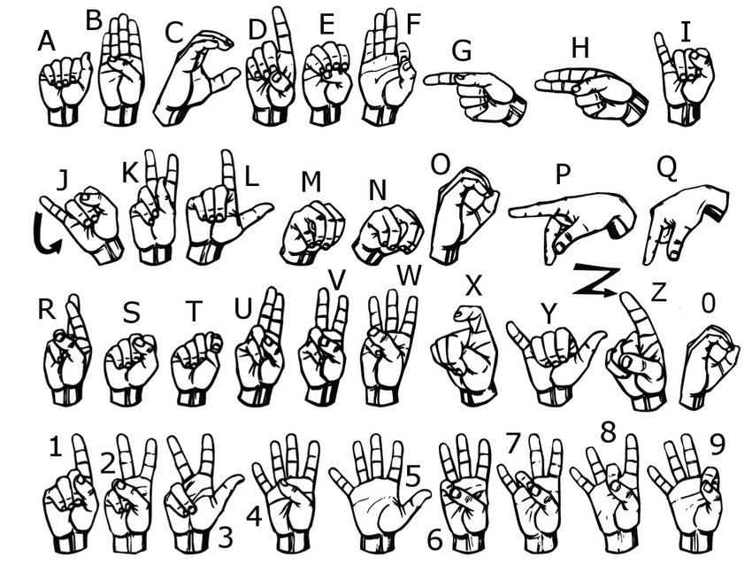

# BridgeSign — Real-Time American Sign Language Recognition

Recognises ASL fingerspelling from a live webcam feed and turns it into typed text and
speech. Hand landmarks are extracted with MediaPipe, classified into one of 38 classes
(26 letters + 10 digits + control gestures), then spell-corrected and spoken aloud.



## How it works

```
webcam → MediaPipe Hands → 21 landmarks × (x, y) = 42 features → classifier → letter
       → SymSpell spell-correction → assembled word/sentence → pyttsx3 text-to-speech
```

Using landmark coordinates rather than raw pixels keeps the feature vector at 42 floats,
which makes the model small, fast on CPU, and largely invariant to lighting and background.

## Pipeline

Run these in order to rebuild the model from scratch:

| Step | Script | What it does |
|---|---|---|
| 1 | `collectImgs.py` | Captures 100 webcam images for each of 38 classes into `./data/<class>/` |
| 2 | `createDataset.py` | Runs MediaPipe over the images, writes 42-feature vectors to `data.pickle` |
| 3 | `trainClassifier.py` | Trains a `RandomForestClassifier`, reports held-out accuracy |
| 3b | `CNN.py` | Alternative 1-D CNN (Conv1D + BatchNorm + Dropout) over the same features |
| 4 | `idky.py` | PyQt5 desktop app — live recognition, spell-correction, speech output |

`godknows.py` / `godknowswhy.py` are extended PyQt5 interfaces built on the same model.
`cnnmodel.py` is a conversion/verification utility for the pickled model files.

## Artifacts

| File | Contents |
|---|---|
| `data.pickle` | Extracted landmark features + labels |
| `modelbest.p`, `modelbestest.p` | Trained classifiers (pickled) |
| `label_encoder.pickle` | `LabelEncoder` mapping class indices back to characters |
| `dictionary.txt` | ~83k-word frequency dictionary for SymSpell |

## Running it

```bash
pip install opencv-python mediapipe scikit-learn tensorflow symspellpy PyQt5 pyttsx3 numpy
python idky.py
```

A webcam is required. Training splits are stratified 80/20.

## Stack

Python · MediaPipe · OpenCV · scikit-learn · TensorFlow/Keras · SymSpell · PyQt5 · pyttsx3

## Known issues

- Model and dataset paths are **hardcoded absolute paths** pointing at
  `/Users/admin/Desktop/American-Sign-language-Detection-System/`. Edit the `DATA_PATH` /
  `INPUT_MODEL_PATH` constants at the top of each script before running on another machine.
- `mmodeli.p` is a 2-byte placeholder, not a usable model.
